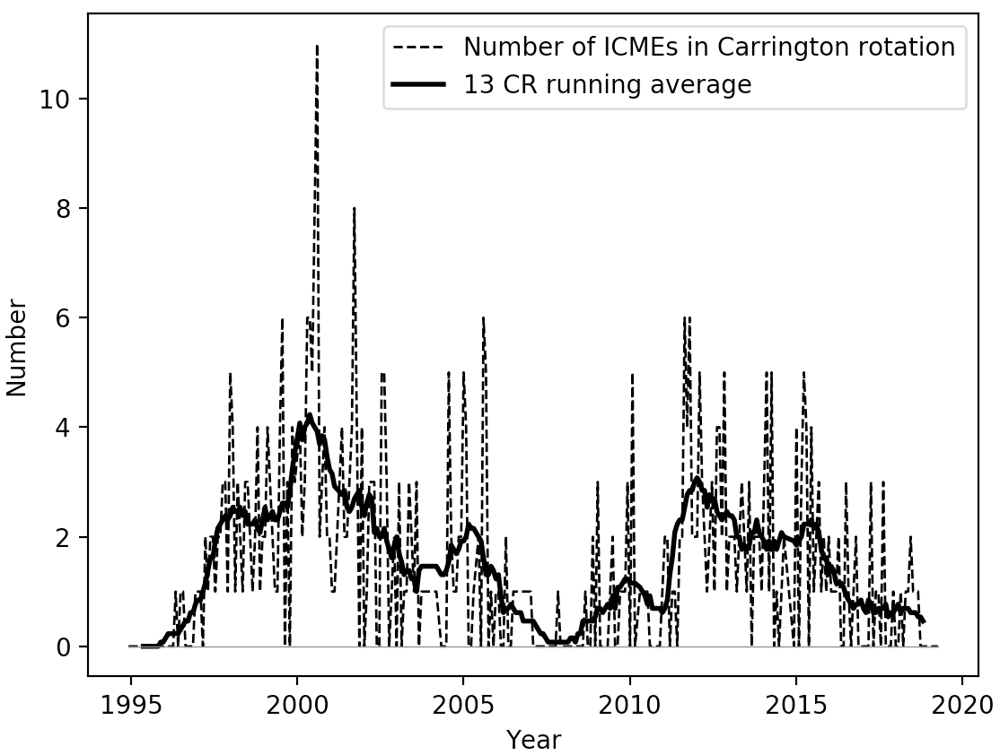
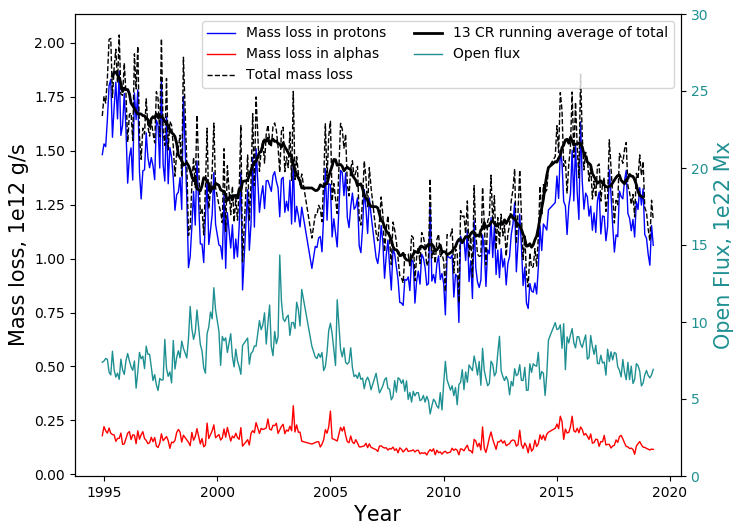

# Direct Detection of Solar Angular Momentum Loss with the Wind Spacecraft

## TL;DR

I was lucky to be given the opportunity to work with [AWESoME Stars](https://empslocal.ex.ac.uk/AWESoMeStars/) at the University of Exeter during the summer between my 3rd and 4th years there. I worked under Prof. Sean Matt and Dr. Adam Finley to obtain a direct measurement of the angular momentum loss rate of the Sun using data from the *Wind* spacecraft. My specific role was to analyse the data to produce the measurement with guidance from the others on the team. The results were written up by Adam and published in the Astrophysical Journal Letters as [*Direct Detection of Solar Angular Momentum Loss with the Wind Spacecraft*](https://arxiv.org/abs/1910.10177).

## Introduction

The Sun is the closest star to us, the only one whose stellar wind is directly measurable. Our knowledge of our star is used as a reference for how we expect other stars in the universe to behave. It is difficult to understand a process in other stars if it is not first understood in the Sun.

The solar wind is an example of something which is not completely understood. It is a stream of charged particles, consisting mostly of protons and electrons from the ionisation of hydrogen, and alpha particles from the ionisation of helium during fusion within the Sun. This wind doesn't travel at one average speed, rather it travels in one of two types of stream; fast and slow. Slow wind is not fully understood, but it is known that it has conditions resembling those at the Sun's corona with an average speed of 400 kms$$^{-1}$$, and originates from areas of the Sun with closed magnetic field lines. The fast wind is better understood, at an average speed of 700 kms$$^{-1}$$. Its conditions match those of the Sun's photosphere, and it originates from coronal holes and areas of open flux. Through the solar wind, the Sun loses approximately 10$$^{12}$$ gs$$^{-1}$$, and this mass carries with it angular momentum.

Over the lifetime of a star, its rotation about its axis will change significantly. During periods of contraction, such as during its formation, conservation of angular momentum causes the rotation to speed up. While on the main sequence however, angular momentum can be lost due to particles in the stellar wind carrying angular momentum away from the Sun, as well as stresses in its own magnetic field applying a torque. 

Multiple methods of estimating the angular momentum loss of the Sun use models to predict a value. Each method yields a different result. Without an experimental value to work towards, it is impossible to know which of these models is the most accurate.

This project aims to produce a value for the rate at which the Sun is losing angular momentum.

## Open flux

The angular momentum flux of the Sun can be calculated theoretically. Magneto Hydrodynamic (MHD) models can be used to obtain a value, and there are many methods of doing so. One such method uses the open flux.

The open flux, the flux along the open field lines in the solar magnetic field, can be related to the Alfvén radius. This is the radius at which the bulk velocity of the waves in the magnetic field equals the Alfvén velocity (Belenkaya et al., 2014). This radius is important, as mathematically, the stresses in the magnetic field exert the torque required to produce co-rotation at the Alfvén radius (Weber and Davis, 1967), though this does not happen physically. Knowing this distance, it is possible to calculate the torque on the Sun due to the magnetic stresses. 

Open flux is defined as
\begin{equation}
\label{eq:flux_integral}
\phi=\int\mathbf{B}\cdot d\mathbf{s}.
\end{equation}
By evaluating the integral over the surface of a sphere, the open flux can be calculated using

\begin{equation}
\label{eq:open-flux}
\phi_{open}=4\pi \langle R^2 |B_r|_{hr} \rangle_{27 days},
\end{equation}

by assuming that the field lines at this radius will be predominantly open. The magnetic field is taken in one hour cadence in order to reduce small time-scale fluctuations before taking the modulus.

Using this value, the magnetisation parameter can be calculated as
\begin{equation}
\label{eq:magnetisation}
\Upsilon_{open} = \frac{\phi_{open}^2 / R_*^2}{\dot{M}v_{esc}},
\end{equation}
where $$R_*$$ is the solar radius ($$6.96\times10^{10}$$cm) and $$v_{esc}=\sqrt{2GM_*/R_*}$$ with $$M_*$$ being the solar mass $$1.99\times10^{33}$$ g. $$\dot{M}$$ represents the mass loss:
\begin{equation}
\label{eq:mdot}
\dot{M}=4\pi\langle R^2 v_r \rho\rangle_{27 days}.
\end{equation}

The magnetisation parameter can be used to obtain the average alfvén radius:

\begin{equation}
\label{alfven}
\frac{\langle R_A \rangle}{R_*} = K_o[\Upsilon_{open}]^{m_o},
\end{equation}

where $$K_o=0.33$$ and $$m_o=0.371$$ (Finley and Matt, 2018) which then allows the torque due to the solar wind to be calculated as

\begin{equation}
\tau = \dot{M}\Omega_*R_*^2 \left( \frac{\langle R_A \rangle}{R_*} \right) ^2.
\end{equation}

$$
\tau = \dot{M}\Omega_*R_*^2 \left( \frac{\langle R_A \rangle}{R_*} \right) ^2.
$$

Here $$\Omega_*$$ is the solar rotation rate, $$2.6\times10^{-6}$$ rads$$^{-1}$$.

This value for the torque can then be compared to that produced via the other three methods, and with the result from the *Wind* data arrived at in this report. Previously, a value of $$2.28\times10^{30}$$ erg was obtained using data from the Ulysses and ACE spacecrafts by Finley et al., 2018.

## Data Analysis

### Coordinate Transformations
The particle and field data from *Wind* is initially given in Geocentric Solar Ecliptic (GSE) coordinates, a cartesian system which defines the x-axis as the direction of the Sun from Earth, the z-axis as the Earth's ecliptic north pole, and the y-axis as perpendicular to both such that it forms a right handed coordinate system.

In order to measure the solar angular momentum flux, however, it is convenient to use Radial, Tangential, Normal (RTN). This is a heliocentric cartesian coordinate system defining X as the line connecting the Sun to the spacecraft, Y as the cross product of the solar rotational axis and X, and Z as perpendicular to both.

### Removing Erroneous Data

Not all data from the *Wind* spacecraft was usable. First, there were many empty values, denoted by an impossible value such as 99999.99 or similar, which had to be removed. If either a component of proton velocity or density was empty, the complete set of data for that observation time was removed. This was because the angular momentum calculation required all the proton values to be correct. Alpha particle values were more frequently empty, and when this was the case the proton data was saved, removing only the alpha velocities and density.

| Flag | Meanings |
|---|---|
| 10 | Solar wind parameters OK - no action necessary |
| 9 | Alpha particles are relatively too cold |
| 8 | Alpha particles overlap within protons in current distribution function |
| 7 | Alphas too fast, out of SWE range |
| 6 | Alpha particle peak may be confused with second proton peak |
| 5 | Parameters OK, but Tp=Ta constraint used (params obtained with SUB\_PROT=1) |
| 4 | Alphas are unusually cold, Tp=Ta constraint used (SUB\_PROT=1) |
| 3 | Alphas are relatively too hot (SUB\_PROT=1). Tp=Ta constraint used |
| 2 | Alphas are unusually slow |
| 1 | Poor peak identification |
| 0 | Spectrum cannot be fit with a bimax model. May be strongly non-Maxwellian or may contain a discontinuity |

Next, the data had to be filtered according to the flags, described in the table above. The alpha particles were prone to issues and the focus of most of the flags. Therefore, the alpha data was removed if it did not correspond with a flag of 10, meaning the parameters were fine. For the protons, most of the flags had little effect. Only data with flags of 1 or 0 had to be removed. If this was not done, the angular momentum loss was often negative, especially during solar minimums.

The removal of most alpha particle data is an issue. In order to obtain a value for the total angular momentum flux at any moment, values for all components are needed. The fact that the data was flagged does not mean there is no alpha component, so a method for reintroducing alpha particles into the data is needed. Since most issues with the alpha particles are due to their peaks being difficult to separate from those of the protons, it is assumed that their speeds were similar. Thus, their velocities are approximated to be equal to those of the proton data at that time. Alpha number densities are approximated to $$4\%$$ of that of the protons (Borrini et al., 1983).

### Interplanetary Coronal Mass Ejections

  <figure>
  <figcaption>**Figure 1:** Number of ICMEs per Carrington rotation according to the Cane and Richardson ICME list. Periods of high ICMEs counts correspond to solar maxima (2001, 2014), while minima (1996, 2009) have very few events.</figcaption></figure>

The aim of this project is to obtain a value of the solar angular momentum loss due to field stresses and the ambient solar wind. Interplanetary Coronal Mass Ejections (ICMEs) are bursts of plasma originating from an event on the Sun's corona. They are expected to have little effect on the global angular momentum loss, and since they are a type of local fluctuation, they should be removed from the data. 

Initially, ICMEs are removed from by placing upper limits on the particle densities and magnetic field strengths. If the proton density at a certain time exceeded this value, none of the values at that time are included in the averages. The first value attempted is a limit of 10 nT for the field and 10 m$$^{-3}$$ for the proton and alpha number densities.

This method appears to be removing too much of the data however, so the Cane and Richardson ICME list is used instead. The number of ICMEs per Carrington according to this list can be seen in Figure 1. The list gives the start times of the shock and the end times of the trailing edge of each ICME since May 1996, so data taken between any of these two times is removed.

For the period which is not covered by the Cane and Richardson ICME list, another method of filtering the data is required. By comparison by eye of different conditions to the data with the ICMEs removed according to the list, a best fit is obtained; 30 nT for the field and 70 m$$^{-3}$$ for the proton and alpha densities.

### Averaging the Data

A Carrington rotation (CR) is the length of time it takes for a sunspot to travel the circumference of the Sun and return to its original location as viewed from the Earth. It is roughly 27 days long, meaning there are 13 of them in a year.

Raw data from *Wind* has a varying cadence of around 2 minutes, though this can vary massively. Carrington rotation averages are taken so that each value would represent an average across the whole solar equator. From this value, a profile for the Sun can be used to obtain an average value across the whole solar surface.

Averages are taken after calculations with the values were made at the 2 minute cadence. If, once data had been processed according to the methods above, there are fewer than 10,000 data points in one Carrington rotation (around 50% of the data points remaining), that rotation is removed and not plotted.

## Results

  <figure>
  <figcaption>**Figure 2:** Mass flux calculated using equation (5). Proton and alpha contributions are plotted in blue and red respectively, with the total mass flux in dashed black.The solid black line is a 13 CR running average of this total. Teal is the open flux, which reflects the solar activity level.</figcaption></figure>

